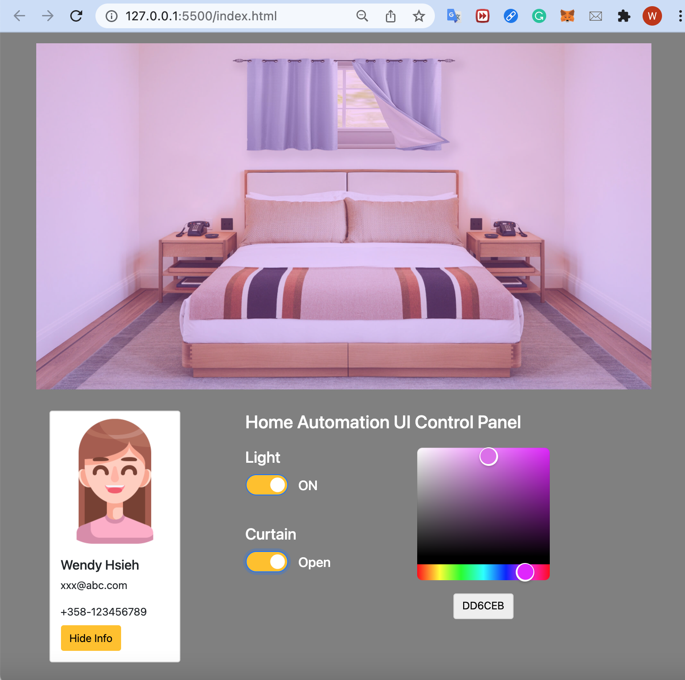

# Vanilla/Plain JS Home Automation UI

An application of home automation simulation UI built with plain JavaScripts.

## Demo

## Tools

- [Adobe Photoshop](https://www.adobe.com/products/photoshop.html): for creating open and closed curtains and the room with multiple image layers
- [Adobe Illustrator](https://www.adobe.com/products/illustrator.html): for creating the SVG light mask
- [Bootstrap](https://getbootstrap.com/): for quickly designing responsive webpage
- [Color Picker Wheel](https://github.com/web-padawan/vanilla-colorful): for changing the SVG light mask color
- [To change any SVGs color](https://stackoverflow.com/questions/22252472/how-to-change-the-color-of-an-svg-element): for changing the color of an SVG image with a HEX color code